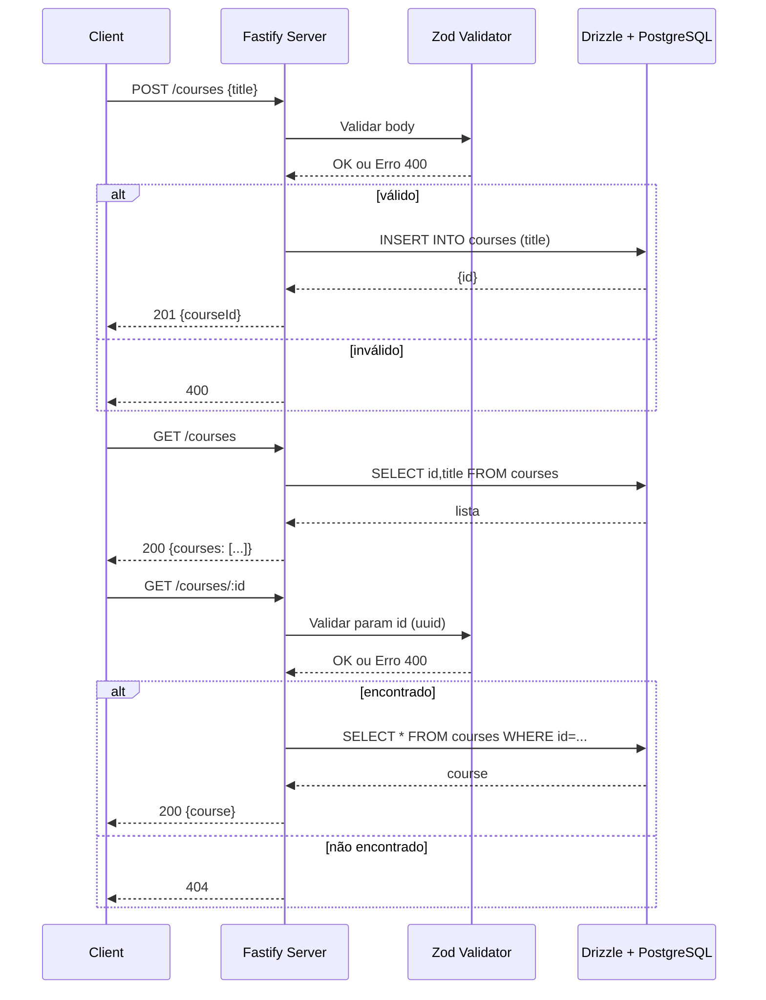

# Projeto Courses

Este projeto foi desenvolvido com foco em uma arquitetura modular, visando facilitar a escalabilidade, manutenção e testes.

## Arquitetura

A arquitetura modular divide o sistema em módulos independentes, cada um responsável por uma funcionalidade específica. Isso permite que novas funcionalidades sejam adicionadas ou modificadas sem impactar o restante do sistema.

## Testes

Os testes são realizados em cada módulo de forma independente, utilizando ferramentas como Jest e Testing Library. Isso garante que cada parte do sistema funcione corretamente e facilita a identificação de problemas.

## Escalabilidade

A arquitetura modular permite escalar o sistema facilmente, seja adicionando novos módulos ou distribuindo módulos existentes em diferentes servidores ou serviços.

## Fluxo principal



## 📁 Arquitetura do Projeto

É de suma importância, que a arquitetura do projeto seja bem definida e organizada, facilitando a manutenção e escalabilidade do sistema. Por tanto, para cada nova funcionalidade ou módulo, deve-se seguir esta estrutura padrão.

```plaintext
.
├── coverage/
├── database/
│   ├── schema/
│   │   └── teste-schema.ts
│   ├── instance.ts
│   ├── seeds.ts
│   └── setup.sql
├── docker/
├── drizzle/
├── node_modules/
├── src/
│   ├── app.ts
│   ├── server.ts
│   └── modules/
│       └── teste-module/
│           ├── repositories/
│           │   ├── repository-teste-create.ts
│           │   ├── repository-teste-update.ts
│           │   ├── repository-teste-delete.ts
│           │   ├── repository-teste-by-id.ts
│           │   └── repository-teste-get.ts
│           ├── routes/
│           │   ├── route-teste-create.ts
│           │   ├── route-teste-update.ts
│           │   ├── route-teste-delete.ts
│           │   ├── route-teste-by-id.ts
│           │   └── route-teste-get.ts
│           ├── route-routes.ts
│           └── route-schema-validations.ts
├── .env
├── .env.test
├── .gitignore
├── docker-compose.yml
├── drizzle.config.ts
├── package.json
├── tsconfig.json
├── vitest.config.ts
└── README.md
```

<br>
<br>
<p align="center">
   Feito com ❤️ by <a target="_blank" href="https://welitonsousa.vercel.app"><b>Weliton Sousa</b></a>
</p>